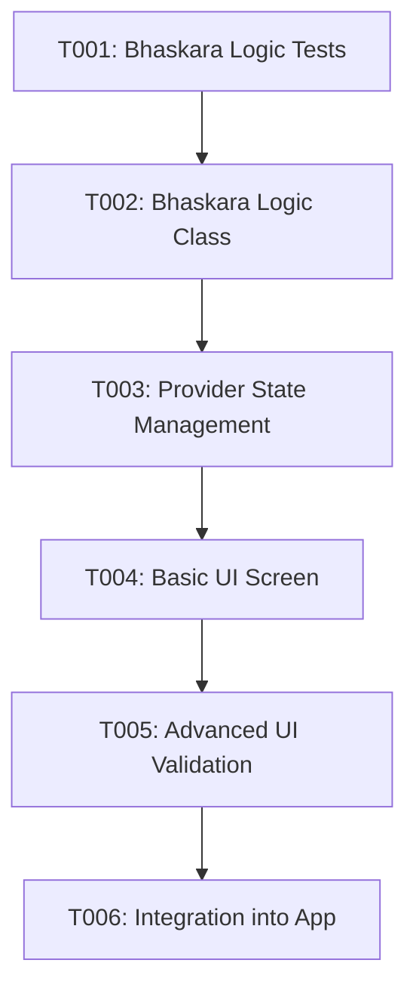

# Implementation Tasks: Bhaskara Formula Operation

**Feature**: 002-bhaskara-operation
**Spec**: [spec.md](./spec.md) | **Plan**: [plan.md](./plan.md)

## Strategy

The Bhaskara Formula Operation feature will be delivered in the following increments:

1. **Phase 1: Setup & Foundational**: Create pure math calculator logic. Tests run in isolation to verify discriminant constraints and roots calculation.
2. **Phase 2: User Story 1 (Calculate Real Roots)**: Add state management (Provider) and the primary UI screen assuming happy-path inputs.
3. **Phase 3: User Story 2 & 3 (Edge Cases)**: Harden Provider and UI to explicitly handle mathematical edge cases (Negative Delta, A=0) with clean error messaging.
4. **Phase 4: Integration**: Register the new screen in the app's main extensible architecture.

### Dependency Graph

---

## Phase 1: Setup & Foundational

**Goal**: Establish the mathematically pure logic to calculate Bhaskara roots without UI dependencies.

- [x] T001 [P] Create unit tests for Bhaskara math logic handling positive, zero, negative delta, and division by zero in `test/logic/bhaskara_calculator_test.dart`
- [x] T002 Implement `BhaskaraCalculator` class with pure logic calculation throwing specific exceptions in `lib/logic/bhaskara_calculator.dart`

---

## Phase 2: User Story 1 - Calculate Two Distinct Real Roots

**Goal**: Build the UI and State Management to handle the happy path of calculating valid quadratic equations.
**Priority**: P1
**Independent Test**: Can be fully tested by entering A=1, B=-3, C=2 to yield X1=2 and X2=1 directly in the UI.

- [x] T003 [US1] Create `BhaskaraProvider` extending ChangeNotifier to track A, B, C inputs and hold the result object in `lib/providers/bhaskara_provider.dart`
- [x] T004 [P] [US1] Create atomic UI input widgets (TextFields for A, B, C) and output display for roots in `lib/ui/screens/bhaskara_screen.dart`

---

## Phase 3: User Stories 2 & 3 - Edge Cases & Validation

**Goal**: Handle mathematical impossibilities cleanly (linear equation fallback, no real roots).
**Priority**: P1 / P2
**Independent Test**: Input A=0 or a negative discriminant (A=1, B=1, C=1) to verify friendly string errors appear instead of app crashes.

- [x] T005 [P] [US2] Add unit tests in `test/ui/bhaskara_screen_test.dart` to verify error states display correctly.
- [x] T006 [US2] Update `BhaskaraProvider` to catch errors from logic class and map to friendly `errorMessage` strings (e.g. "No real roots") in `lib/providers/bhaskara_provider.dart`
- [x] T007 [US3] Update `BhaskaraProvider` and UI inputs to prevent calculation or show validation immediately if A is set to 0 in `lib/providers/bhaskara_provider.dart` and `lib/ui/screens/bhaskara_screen.dart`

---

## Phase 4: Polish & Integration

**Goal**: Ensure the feature is accessible via the main calculator architecture.

- [x] T008 Integrate `BhaskaraScreen` and register `BhaskaraProvider` into the main app entrypoint/navigation (e.g., `lib/main.dart` or `lib/ui/screens/home_screen.dart` depending on the extensible calculator architecture).
- [x] T009 Run `flutter analyze` and `flutter test` to ensure Constitution Principle IV is satisfied (Zero warnings, passing tests).
